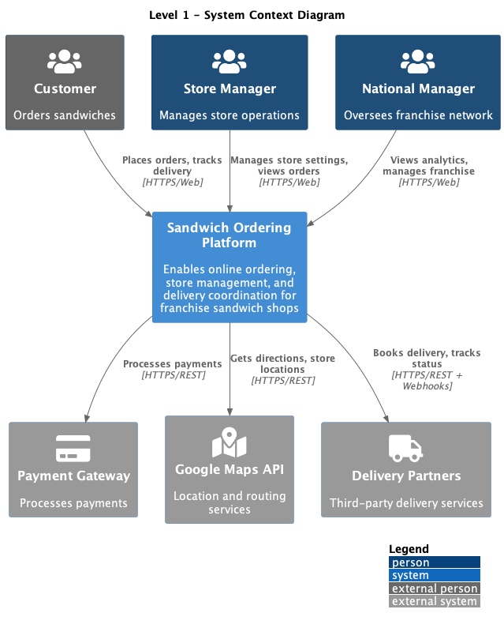
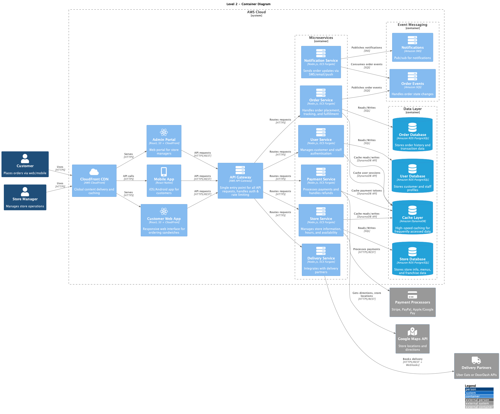
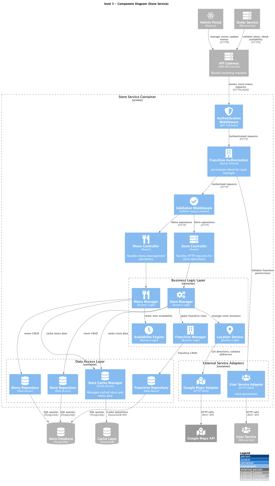
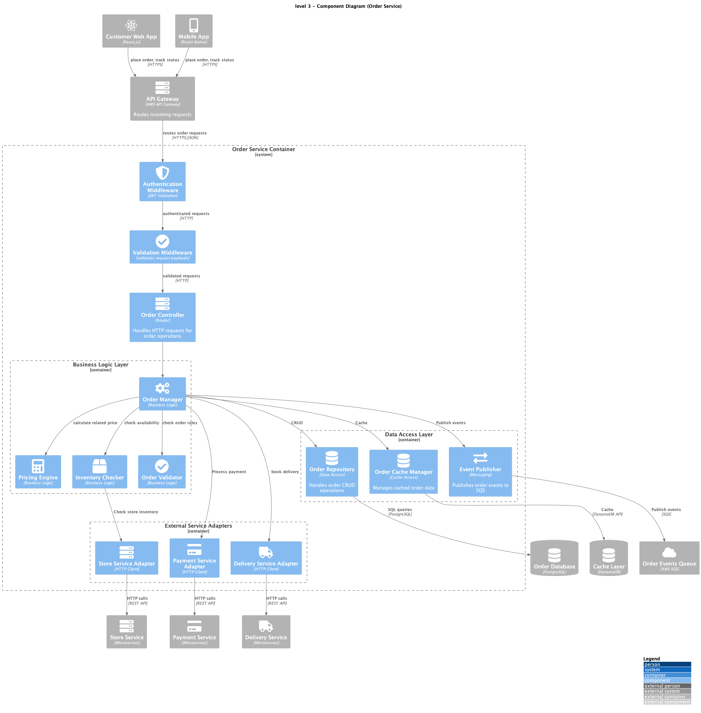

# A Sandwich: Monolithic to Microservices

[Google Slides for Presentation](https://docs.google.com/presentation/d/1ivXbKQ00cisjvwMAn3L_oMIIJNO4YoIq0GH0czjISAE/edit?usp=sharing)

## Architecture Diagrams

### Level 1: Context Diagram

### Level 2: Container Diagram

### Level 3: Component Diagrams

#### Store Service

#### Order Service

